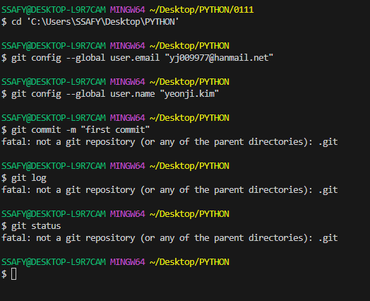
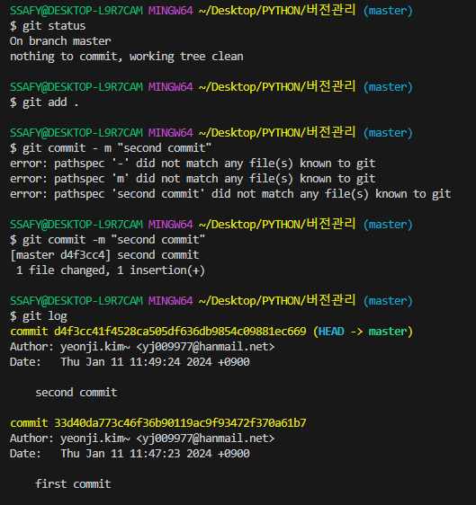
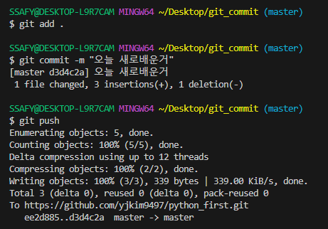
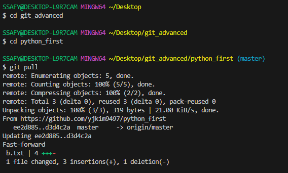

#### GUI(Graphic User Interface)
- 그래픽을 통해 사용자와 컴표터가 상호 작용하는 방식

## CLI(Command Line Interface)
- 명령어를 통해 사용자가 컴표터가 상호 작용하는 방식

ls : 폴더내에 있는것을 보여줌  
cd 0111 : 0111 폴더로 이동

### 왜 CLI를 사용해야 할까?
  - GUI는 사용하기 쉽지만 단계가 많고 성능을 상대적으로 더 많이 소모
  - 수 많은 서버 / 개발 시스템이  CLI를 통한 조작 환경을 제공함

### CLI에서 .(점)의 역할
- . : 현재 위치(현재 디렉토리)
- .. : 현재의 상위 디렉토리

### 기초 문법
- touch : 파일 생성
- mkdir : 새 디렉토리 생성
- ls : 현재 작업 중인 디렉토리 내부의 폴더/파일 목록을 출력
- cd : 현재 작업 중인 디렉토리를 변경(위치 이동)
- start : 폴더/파일을 열기(Mac에서는 open을 사용)
- rm : 파일 삭제(-r옵션을 사용해 디렉토리 삭제)

### CLI 환경에서 가장 중요 한 것
- 내가 어디있는지(경로) 알아야 한다
  - 절대 경로 : Root 디렉토리부터 목적 지점까지 거치는 모든 경로를 전부 작성한 것
    - 윈도우 바탕 화면의 절대 경로 예시
    - C:/Users/ssafy/Desktop
  - 상대 경로 : 현재 작업하고 있는 디렉토리를 기준으로 계산된 상대적 위치를 작성한 것
    - 만약 현재 작업하고 있는 디렉토리가 C:/Users일 때   
      윈도우 바탕 화면으로의 상대 경로는 ssafy/Desktop

---

# Git(분산 버전 관리)
- 버전 관리 : 변화를 기록하고 추적하는 것
  - 예시 : 구글 독스
- 중앙집중식 : 버전은 중앙 서버에 저장되고 중앙 서버에서 파일을 가져와 다시 중앙에 업로드
- 분산식 : 버전을 여러 개의 복제된 저장소에 저장 및 관리
- 분산 구조의 장점
  - 중앙 서버에 의존하지 않고도 동시에 다양한 작업을 수행
    - 개발자들 간의 작업 충돌을 줄여주고 개발 생산성을 향상
  - 중앙 서버의 장애나 손실에 대비하여 백업과 복구가 용이
  - 인터넷에 연결되지 않은 환경에서도 작업을 계속할 수 있음
    - 변경 이력과 코드를 로컬 저장소에 기록하고, 나중에 중앙 서버와 동기화
  
### git의 역할
- 코드의 버전(히스토리) 관리
  - 개발되어 온 과정 파악
- 이전 버전과의 변경 사항 비교

## git : 분산 버전 관리 시스템
- 코드의 변경이력을 기록하고 협업을 원할하게 하는 도구

### git의 영역
- Working Directory
- Staging Area
- Repository

### Working Directory
- 실제 작업중인 파일들이 위치하는 영역

### Staging Area
- Working Directory에서 변경된 파일 중, 다음 버전에 포함시킬 파일들을   
  선택적으로 추가하거나 제외할 수 있는 중간 준비 영역

### Repository
- 버전(commit) 이력과 파일들이 영구적으로 저장되는 영역
- 모든 버전(commit)과 변경 이력이 기록됨

### Commit
- 변경된 파일들을 저장하는 행위이며, 마치 사진을 찍듯이 기록한다 하여 'snapshot' 이라고도 함
  
### git init
- 로컬 저장소 설정(초기화)
  - git의 버전 관리를 시작할 디렉토리에서 진행

### git add
- 변경사항이 있는 파일을 staging area에 추가
  
### git commit
- staging area에 있는 파일들을 저장소에 기록
  - 해당 시점의 버전을 생성하고 변경 이력을 남기는 것
- git commit -m : 메세지를 남기는 옵션(메세지 남기는건 필수)

### git status
- 현재 로컬 저장소의 파일 상태 보기
### git log
- commit 목록 확인
- git log --oneline : commit 목록 한 줄로 보기
- git config --global -l : git global 설정 정보 보기

#### clear : terminal 리셋

### 첫 commit때 필요
#### - git config --global user.email "메일주소"
#### - git config --global user.name "유저네임"

working directory --git add . --> staging area --commit 메세지--> repository

### git init 주의사항
- git 로컬 저장소 내에 또다른 git 로컬 저장소를 만들지 말 것
- 즉, 이미 git 로컬 저장소인 디렉토리 내부 하단에서 git init 명령어를 다시 입력하지 말 것
- git 저장소 안에 git 저장소가 있을 경우 가장 바깥 쪽의 git 저장소가   
   안쪽의 git 저장소의 변경사항을 추적할 수 없기 때문

