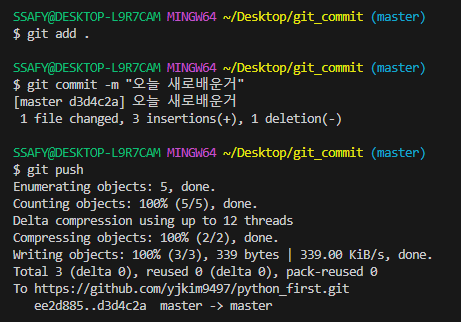
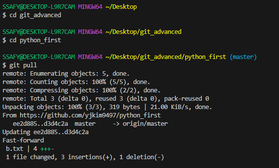

# 원격 저장소(Remote Repository)
- GitLab, GitHub, Bitbucket

### git remote add origin remote_repo_url
- 로컬 저장소에 원격 저장소 주소 추가

### 로컬에서 init하고 github repository생성시 주의사항
- Initialize this repository with:  
      Add a README file 체크하지 말고 생성

### push / pull & clone
- push : 업로드
- pull : 다운로드
- clone : (주로)최초 1회 저장소 복제, 이후엔 변경사항만 가져오기(pull)

### git push -u origin master
- origin : 저장소 이름
- master : branch 이름
- push할때는 git push 만 해도 가능

### git pull origin master

### git clone remote_repo_url
- clone으로 받은 프로젝트는 이미 git init이 되어있음

